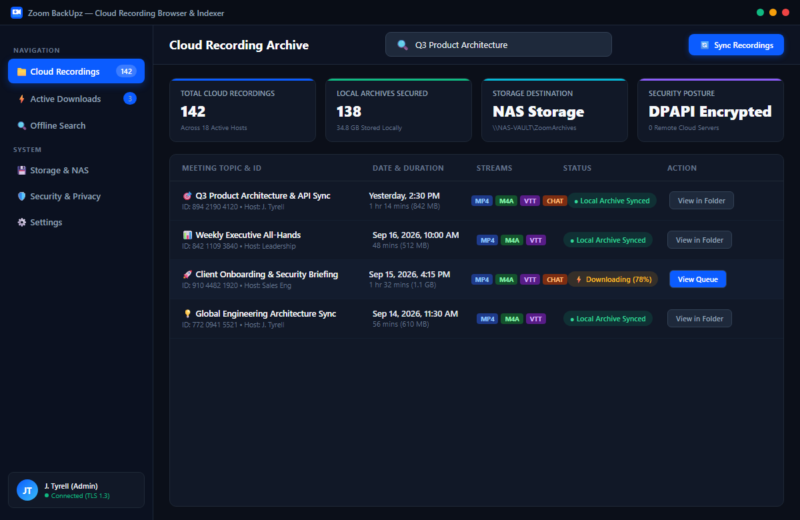
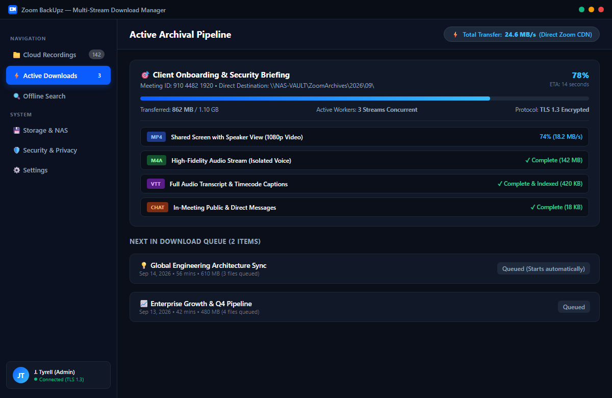
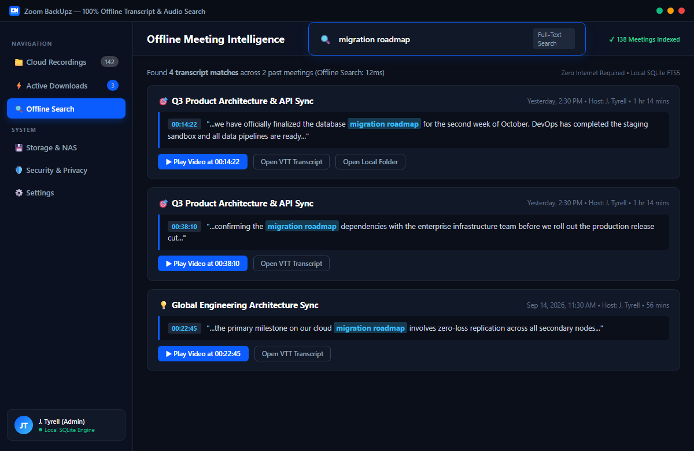
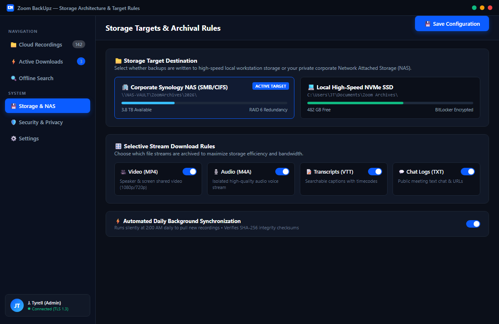
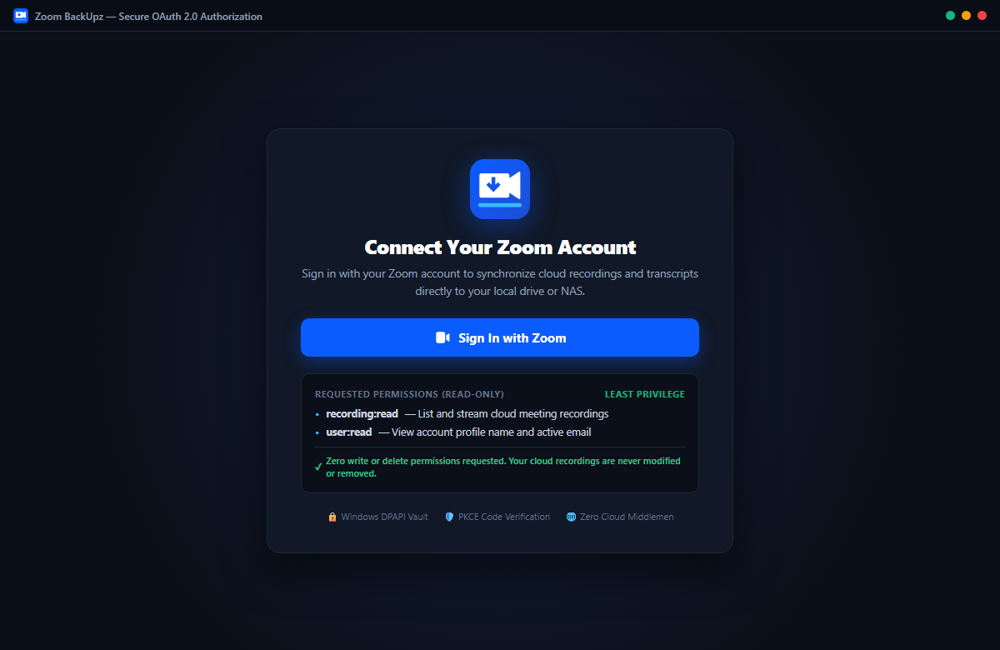
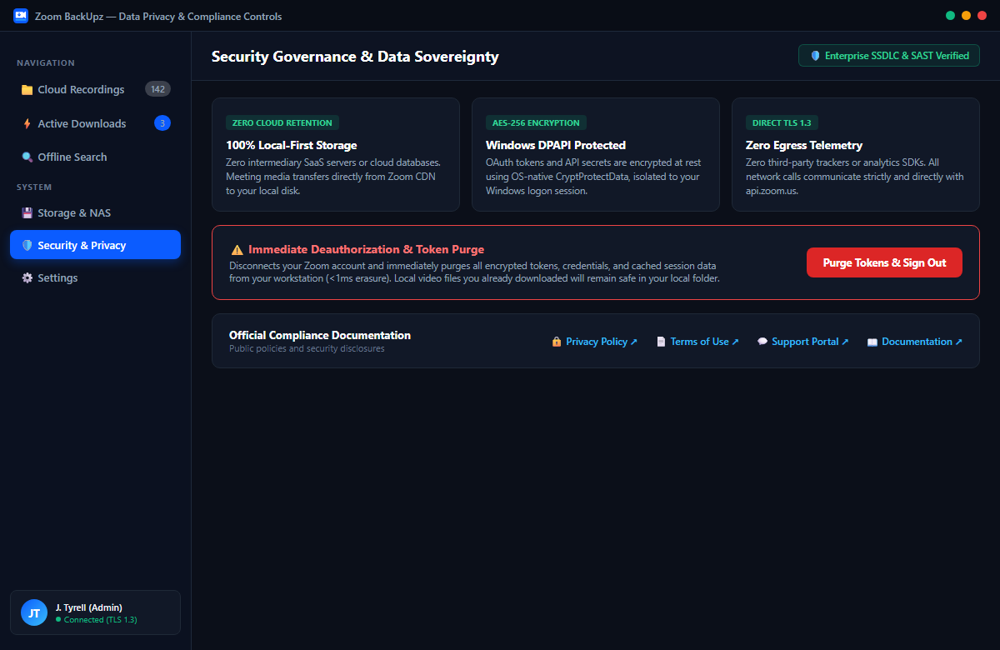

# Zoom-Backup-callback

  

  
  
  
  

Official web portal, authentication callback redirect handler, and compliance documentation host for **Zoom BackUpz** (the desktop backup and indexing suite for Zoom Cloud Recordings).

  

---

## Desktop Application Showcase

| 1. Cloud Recording Browser & Catalog | 2. Multi-Stream Download Manager |
| :---: | :---: |
|  |  |
| *Browse Zoom Cloud recordings, search by topic/date, and view sync status.* | *Active concurrent downloads of MP4 video, M4A audio, and VTT captions.* |

| 3. Offline Search & Transcript Discovery | 4. Storage Targets & Archiving Rules |
| :---: | :---: |
|  |  |
| *Full-text offline transcript search with instant timestamp playback jumps.* | *Configure local NVMe SSD or Corporate NAS targets with auto-sync schedules.* |

| 5. Secure OAuth 2.0 PKCE Authorization | 6. Data Sovereignty & Privacy Governance |
| :---: | :---: |
|  |  |
| *Least-privilege read-only permissions with Windows DPAPI vaulting.* | *Zero cloud retention, instant token purge, and compliance disclosures.* |

---

## Relationship to the Main Application

This repository serves as the **supporting web layer** for the main desktop application:

* **Main Application Repository:** [**JTyrell/Zoom-Indexer**](https://github.com/JTyrell/Zoom-Indexer)  
  *Contains the core Flutter Windows desktop software, local SQLite indexer, Windows DPAPI credential vault, and background tray download engine.*

### What This Supporting Service Does

1. **OAuth 2.0 Loopback & Protocol Handover:** When users click *"Sign In with Zoom"* in the desktop application, Zoom authorizes the request and redirects to this service. The service executes an automatic protocol redirect (`zoombackup://callback?code=...`) to return the user seamlessly to the running Windows desktop client.
2. **Resilient Fallback Interface:** If client-side browser security configurations suppress protocol handlers, the webpage displays a manual "Open Zoom Backup System" launcher button and a copyable Authorization Code snippet.
3. **Public Documentation & Legal Host:** Hosts the public, production-ready compliance pages mandated by the Zoom App Marketplace review process.

---

## Live Compliance & Documentation Pages

All pages are deployed live with high availability on Cloudflare Pages and mirrored on GitHub Pages:

| Resource | Primary URL (Cloudflare Pages) | Secondary Mirror (GitHub Pages) | Description |
| :--- | :--- | :--- | :--- |
| **Landing & Callback** | [zoom-backup-callback.pages.dev](https://zoom-backup-callback.pages.dev/) | [jtyrell.github.io/zoom-backup-callback](https://jtyrell.github.io/zoom-backup-callback/) | Dual-purpose landing page and OAuth redirect handler |
| **User Guide & Docs** | [zoom-backup-callback.pages.dev/docs](https://zoom-backup-callback.pages.dev/docs) | [jtyrell.github.io/zoom-backup-callback/docs](https://jtyrell.github.io/zoom-backup-callback/docs) | Instructions for Adding, Using, and Removing the app |
| **Privacy Policy** | [zoom-backup-callback.pages.dev/privacy](https://zoom-backup-callback.pages.dev/privacy) | [jtyrell.github.io/zoom-backup-callback/privacy](https://jtyrell.github.io/zoom-backup-callback/privacy) | GDPR/CCPA local-first privacy policy |
| **Terms of Use** | [zoom-backup-callback.pages.dev/terms](https://zoom-backup-callback.pages.dev/terms) | [jtyrell.github.io/zoom-backup-callback/terms](https://jtyrell.github.io/zoom-backup-callback/terms) | Software license and acceptable use terms |
| **Support Center** | [zoom-backup-callback.pages.dev/support](https://zoom-backup-callback.pages.dev/support) | [jtyrell.github.io/zoom-backup-callback/support](https://jtyrell.github.io/zoom-backup-callback/support) | Help desk, 24–48h SLA, FAQ, and troubleshooting |
| **Configure Guide** | [zoom-backup-callback.pages.dev/configure](https://zoom-backup-callback.pages.dev/configure) | [jtyrell.github.io/zoom-backup-callback/configure](https://jtyrell.github.io/zoom-backup-callback/configure) | Post-authorization configuration management |

---

## Community & Issue Trackers

- **Desktop Application Issues:** [JTyrell/Zoom-Indexer Issues](https://github.com/JTyrell/Zoom-Indexer/issues)
- **Web Portal & Callback Issues:** [JTyrell/Zoom-Backup-callback Issues](https://github.com/JTyrell/Zoom-Backup-callback/issues)
- **Support Email:** [support@zoombackup.pages.dev](mailto:support@zoombackup.pages.dev)

---

## License

Copyright © 2026 Zoom BackUpz. All rights reserved.  
*Zoom is a registered trademark of Zoom Video Communications, Inc. Zoom BackUpz is an independent application and is not affiliated with, sponsored by, or endorsed by Zoom Video Communications, Inc.*
